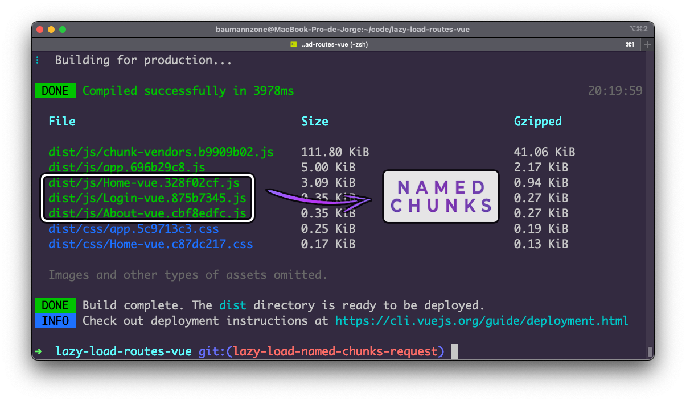
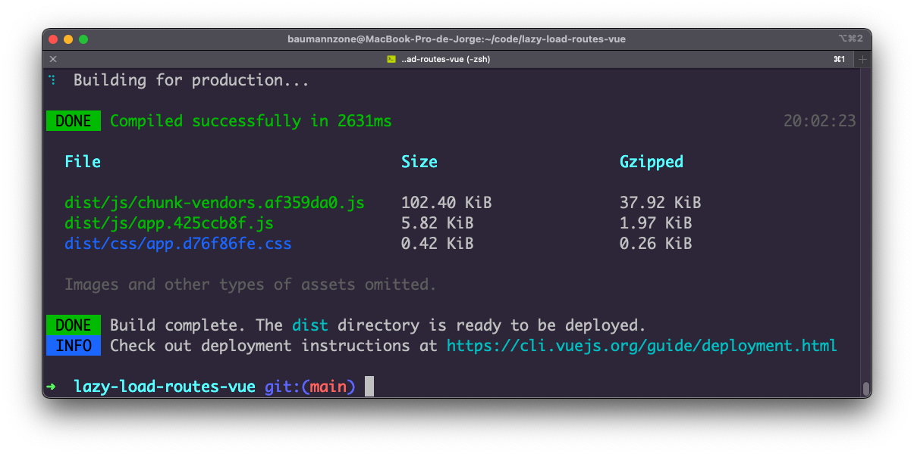
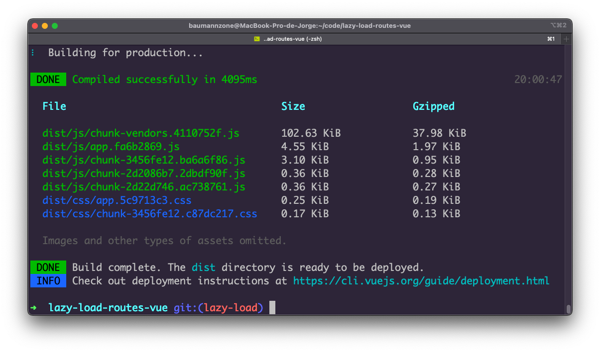
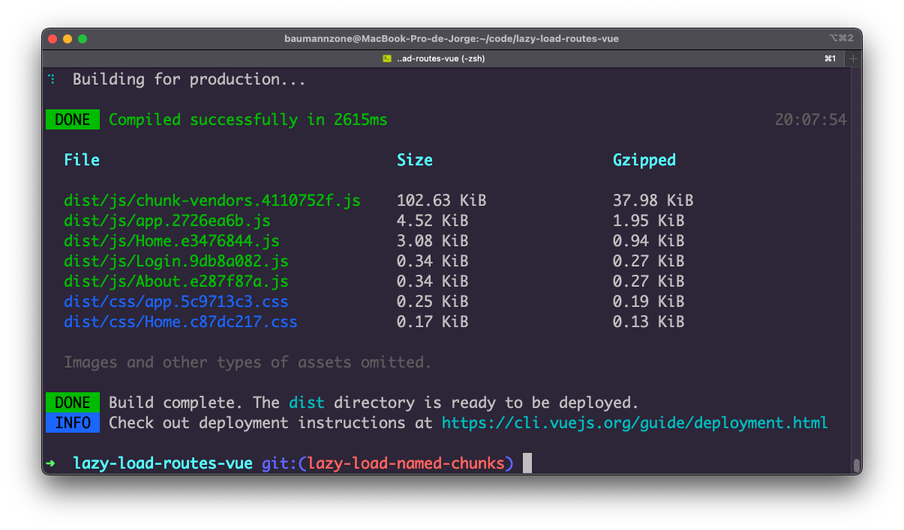
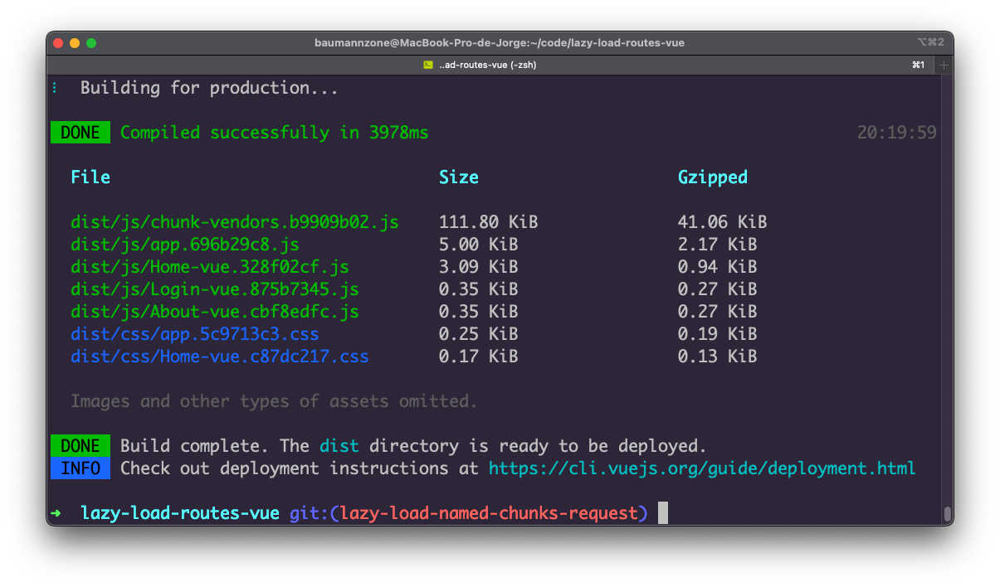
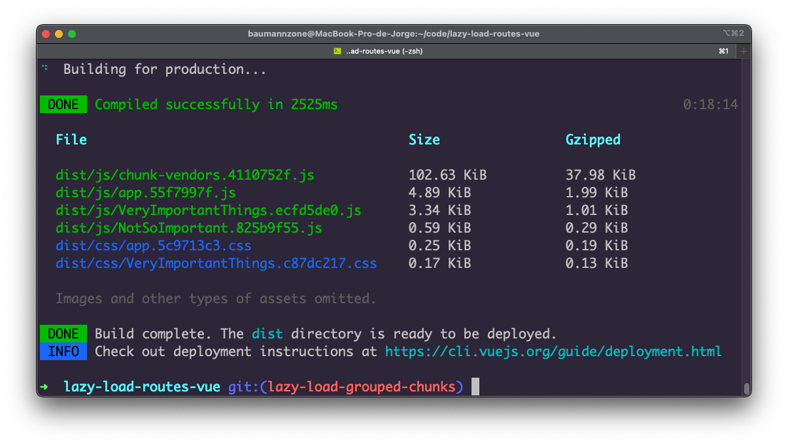

# Vue.js: How to lazy load routes 
> With Webpack magic comments 🔮



---

## Branches

Each branch has its own router code. There are 5 branches:

- `main`: Routes without lazy loading.
- `lazy-load`: Lazy loading routes with randomly generated hashed chunks.
- `lazy-load-named-chunks`: Lazy loading routes with manually generated named chunks.
- `lazy-load-named-chunks-request`: Lazy loading routes with dynamically generated named chunks.
- `lazy-load-grouped-chunks`: Lazy loading routes grouped into two separate chunks.

## Build output

- `main`:  
  
  
- `lazy-load`:  
  

- `lazy-load-named-chunks`:  
  

- `lazy-load-named-chunks-request`:  
  

- `lazy-load-grouped-chunks`:  
  

## Project setup
```
npm install
```

### Compiles and hot-reloads for development
```
npm run serve
```

### Compiles and minifies for production
```
npm run build
```

### Lints and fixes files
```
npm run lint
```

### Customize configuration
See [Configuration Reference](https://cli.vuejs.org/config/).


---

> Twitter [@baumannzone](https://twitter.com/baumannzone) &nbsp;&middot;&nbsp;
> Instagram [@baumannzone](https://instagram.com/baumannzone) &nbsp;&middot;&nbsp;
> Twitch [@baumannzone](https://twitch.tv/baumannzone) &nbsp;&middot;&nbsp;
> YouTube [RambitoJS](https://www.youtube.com/channel/UCTTj5ztXnGeDRPFVsBp7VMA)
